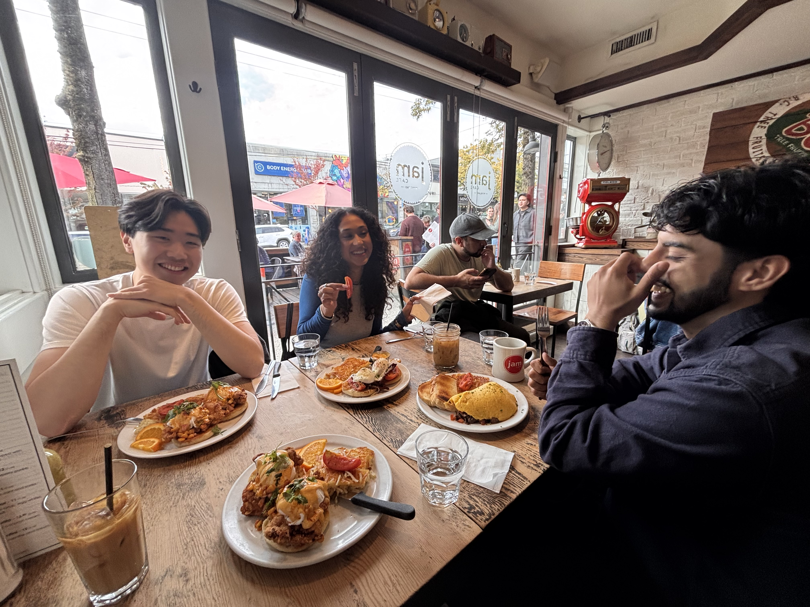

My first in MDS has been very fast paced. From the first day of classes, learning statistics, coding platforms, and two coding languages felt like a big refresher. As I hadn't been in university since 2013, going from work-mode to study-mode meant having to adapt to a new schedule, new community, and new habits.

What surprised me about the MDS program was how varying everyone's experiences were from my own within the program. Meeting students from all parts of the world, with backgrounds ranging from software engineers to biology majors, gave perspective on how my lack of experience with technical skills like coding in Python, aren't isolated.

Now that the first week is done, I have a much better gauge on what is to come. I understand that there will be long days where I will sometimes feel like I don't know what I'm doing. However, I believe that in keeping myself engaged with my peers, asking questions in class, and staying studious outside of class, I will learn a lot within the program and be confident in my ability to work towards being a data scientist when entering industry.

